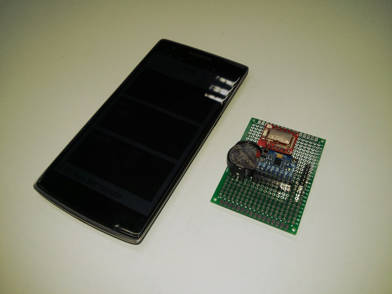
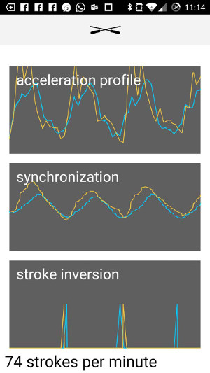

# Rowbot: Personalized Rowing Advice

A photograph of one of the prototype boards.

## Introduction

Learning how to row most efficiently can be hard. There are various performance indicators such as synchronicity between crew members or stroke profile, but these are difficult to track manually.

We have developed a miniature wireless device that attaches near the rower's wrist (or on one of the oars) and tracks these indicators in real-time.

The device can both analyze data by itself and give personalized advice, or can be used by the team coach to track the performance of the team.

## How it works

The device is a small Bluetooth SoC with a gyroscope and accelerometer. It measures acceleration and angular velocity, and forwards it to a mobile phone via Bluetooth where this data is analysed using smart signal processing algorithms and then used to produce real-time time plots and personalized advice.

## Performance indicators

### Synchronization analysis

Synchronization between team members can be tracked by looking at the acceleration profiles of each member superposed on the same plot. The team coach can use this data to provide feedback and improve cooperation.

### Stroke pattern consistency and length analysis

From the peaks of the acceleration profile, each stroke can be detected. This can be used to analyze stroke length, and optimize rowing rate. Acceleration profile of each stroke can be compared to analyze consistency.

### Blade depth analysis

It is important that the blade during each stroke is both not too deep and not too high above the water. This can be analyzed by looking at vertical position vs time. Depth of the blade can be extrapolated from the length of the oar.

### Example session

Below is a screenshot of the mobile app reading data from two sensors attached to two different people.

